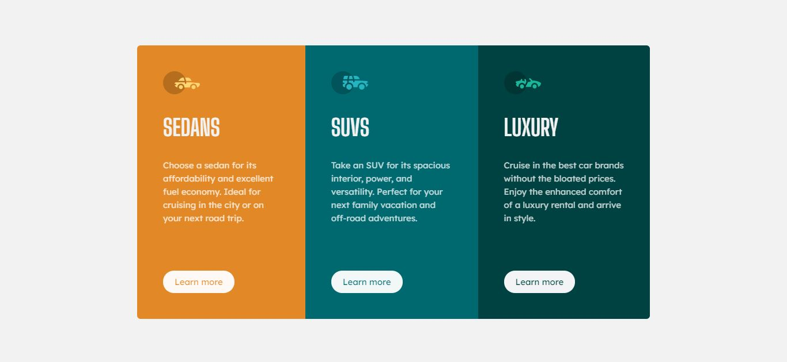

# Frontend Mentor - 3-column preview card component solution

This is a solution to the [3-column preview card component challenge on Frontend Mentor](https://www.frontendmentor.io/challenges/3column-preview-card-component-pH92eAR2-). Frontend Mentor challenges help you improve your coding skills by building realistic projects. 

## Table of contents

- [Overview](#overview)
  - [The challenge](#the-challenge)
  - [Screenshot](#screenshot)
  - [Links](#links)
- [My process](#my-process)
  - [Built with](#built-with)
- [Author](#author)

## Overview

### The challenge

Users should be able to:

- View the optimal layout depending on their device's screen size
- See hover states for interactive elements

### Screenshot

#### Desktop

#### Mobile

### Links

- Solution URL: [https://sharp-hugle-6582a7.netlify.app/](https://sharp-hugle-6582a7.netlify.app/)
- Live Site URL: [https://www.frontendmentor.io/solutions/3column-preview-card-component-0zw6md9kA](https://www.frontendmentor.io/solutions/3column-preview-card-component-0zw6md9kA)

## My process

### Built with

- Semantic HTML5 markup
- CSS3
- Flexbox

## Author

- Frontend Mentor - [@gustavoA7X612BR](https://www.frontendmentor.io/profile/gustavoA7X612BR)
- Instagram - [@gustavo.monteiro.68](https://www.instagram.com/gustavo.monteiro.68)
